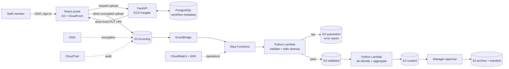

# Public Health Reporting Workflow

A portfolio-safe recreation of an event-driven reporting system I designed for public-health
operations. It replaces scattered file handling and memory-based follow-up with a controlled
workflow that validates submissions, quarantines questionable data, creates de-identified
aggregates, records operational state, and preserves lineage.

> **Reconstruction notice:** This repository was built from a description of the system, not from
> an employer's source code, AWS account, or data. Every sample record is invented. It is a
> technical demonstration, not a production system and not a claim that this exact repository ran
> in the former environment.

## Try it without AWS

The local path uses only Python's standard library and exercises the real validation and reporting
code used by the Lambda handlers.

```powershell
$env:PYTHONPATH="$PWD/src"
python -m health_reporting.cli sample-data/valid-participants.csv
python -m health_reporting.cli sample-data/invalid-participants.csv
python -m unittest discover -s tests -v
```

On macOS/Linux, replace the first line with `export PYTHONPATH="$PWD/src"`.

The valid file moves through simulated `incoming`, `validated`, `curated`, and `archive` locations.
The invalid file stops in `quarantine` with a structured row-level report. `local-data/workflow.db`
tracks cycle and submission state separately from file content, mirroring the role of PostgreSQL.

## Architecture



See [docs/architecture.md](docs/architecture.md) for boundaries, decisions, and the local-to-AWS
mapping.

## What is implemented

| Capability | Local demo | AWS reference stack |
|---|---:|---:|
| CSV schema, duplicate, date, code, and cross-period validation | Yes | Lambda |
| Safe normalization without guessing sensitive values | Yes | Same Python module |
| Quarantine plus machine-readable error report | Filesystem | Versioned, KMS-encrypted S3 |
| De-identified aggregate report | Yes | Lambda to curated prefix |
| Workflow state separated from files | SQLite | PostgreSQL schema/RDS scaffold |
| Event-driven orchestration | Function call | S3 → EventBridge → Step Functions |
| Staff upload portal and short-lived upload URL API | UI build | React/CloudFront + FastAPI/Fargate |
| Role checks | Local demo role | OIDC JWT roles/groups |
| Audit and operational alerts | Test artifacts | CloudTrail, CloudWatch, SNS |
| Recovery controls | Re-runnable demo | S3 Versioning, RDS backups/PITR settings |

The PostgreSQL schema is included but is not automatically migrated or wired to the demo API. The
local SQLite adapter proves the state model; a production implementation would add migrations and a
PostgreSQL repository before enabling the full stack. External identity-provider registration,
manager approval screens, and submission to a real agency are also intentionally environment-specific.

## Repository map

- `src/health_reporting/` — validation, aggregation, local workflow, API, and Lambda handlers
- `frontend/` — accessible React/Vite portal mockup
- `infra/terraform/` — encrypted data plane plus opt-in VPC/ECS/RDS control plane
- `database/schema.sql` — PostgreSQL workflow metadata model (no participant rows)
- `sample-data/` — invented passing and failing CSVs
- `tests/` — standard-library unit and end-to-end tests
- `docs/runbooks/` — quarantine, workflow failure, and recovery procedures

## Run the portal

```bash
cd frontend
npm ci
npm run dev
```

The page is a working UI shell. Uploads require the FastAPI service plus an S3 bucket and AWS
credentials; local visual review does not. For API development:

```bash
python -m venv .venv
python -m pip install -e ".[dev]"
uvicorn health_reporting.api:app --reload --port 8080
```

## Terraform

The default plan creates the event-driven data plane, CloudFront frontend origin, monitoring, and
audit trail. It does **not** create the costlier NAT Gateway, ALB, Fargate service, or RDS instance.

```bash
cd infra/terraform
cp terraform.tfvars.example terraform.tfvars
terraform init
terraform fmt -check -recursive
terraform validate
terraform plan
```

Review the plan and current AWS pricing before applying. To deploy the full control plane, build and
publish the API image, provide an ACM certificate and OIDC settings, then explicitly set
`enable_full_stack = true`. Details are in [infra/terraform/README.md](infra/terraform/README.md).

## Data safety

Do not put protected health information, personally identifiable information, employer data, or
credentials in this repository. The sample IDs are synthetic, the final report contains only grouped
counts, S3 public access is blocked, workflow execution payload logging is disabled, and secrets are
never Terraform outputs in plaintext. See [docs/security-and-privacy.md](docs/security-and-privacy.md).

## Design intent

The point of the project is operational control, not a long list of AWS logos: the workflow knows
what arrived, which version was checked, why it failed, what was safely corrected, which aggregate
was produced, and what still requires a human decision.
