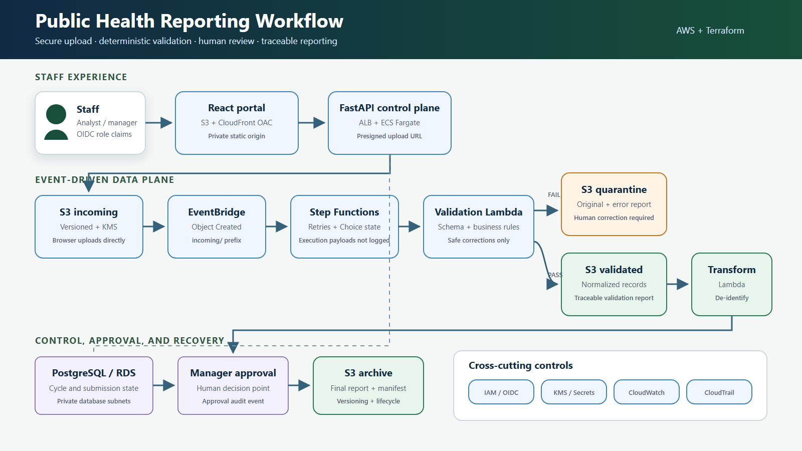

# Architecture and design decisions

## Two paths, one validation contract

The zero-cloud path copies a CSV into filesystem prefixes, runs `validation.py`, writes either a
quarantine report or validated CSV, aggregates passing rows, creates a lineage manifest, and records
state in SQLite. The AWS path packages the same validation and aggregation modules into Lambda.
Only storage, orchestration, and metadata adapters change.

| Concern | Local adapter | AWS adapter |
|---|---|---|
| Object storage | `local-data/<prefix>` | versioned S3 with KMS |
| Event | direct CLI call | S3 event through EventBridge |
| Orchestrator | `run_local_workflow` | Step Functions |
| Compute | local Python | Lambda; FastAPI on Fargate |
| Workflow metadata | SQLite | PostgreSQL/RDS target model |
| Alert | CLI result | SNS + CloudWatch alarm |
| Audit | manifest and state rows | manifest, CloudTrail, database audit events |

## Data flow

1. An authenticated analyst asks the API for a short-lived upload URL.
2. The browser sends the CSV directly to `incoming/<cycle>/<dataset>/<uuid>-<filename>`.
3. S3 publishes an Object Created event to EventBridge.
4. EventBridge starts Step Functions with the S3 event envelope.
5. The validation Lambda reads cycle dates from `configuration/cycles/<cycle>.json`.
6. Safe formatting differences are normalized. Ambiguous or contradictory values are errors.
7. Failed input is copied, unchanged, under `quarantine/` beside a JSON error report.
8. Passing input is written to `validated/`; a second Lambda creates grouped counts in `curated/`.
9. The state reaches `AWAITING_APPROVAL`. A production control plane would record the artifact,
   require a manager decision, and copy the approved report plus its manifest to `archive/`.

## Trust boundaries

- The frontend bucket is private. CloudFront reads it using signed Origin Access Control requests.
- The data bucket blocks all public access and denies non-TLS requests.
- A presigned URL delegates one `PutObject` operation for one generated key for 15 minutes by default.
- Fargate tasks run in private subnets. Only the ALB security group can reach their application port.
- RDS is in isolated subnets, is not public, and accepts PostgreSQL only from the API security group.
- Staff authorization is expressed as OIDC roles: analysts upload/review; managers configure/approve;
  infrastructure access does not imply participant-data access.
- Lambda IAM is prefix-scoped. Step Functions can invoke only the two workflow functions and publish
  only to the operations topic.

## Validation contract

Required fields are `participant_id`, `program_code`, `service_date`, `outcome_achieved`, and
`age_group`. The example rules check missing IDs, duplicate IDs, approved program codes, parseable
dates, dates inside the reporting window, controlled age groups, and recognizable boolean values.

Allowed automatic corrections are deterministic and reversible: trimming whitespace, uppercasing a
known code, converting accepted date formats to ISO 8601, and mapping explicit yes/no variants. The
system does not invent identifiers, merge duplicates, or resolve contradictions.

## Relational state versus object content

Participant-level files belong in encrypted object storage. PostgreSQL answers operational questions:
which cycle is active, what is required, which version arrived, which validation ran, how many errors
remain, which aggregate was approved, and who made the decision. `database/schema.sql` demonstrates
that separation without putting participant records into relational tables.

## Fidelity and deliberate gaps

The repository faithfully implements the validation/quarantine/aggregation data plane, local state,
AWS event wiring, encryption, audit, monitoring, portal shell, presigned-upload API, network boundaries,
and PostgreSQL schema. Enterprise IdP registration, the PostgreSQL application adapter/migrations,
approval UI, deadline evaluator, external-agency transport, and organization-specific retention are
left explicit because inventing them would be misleading.
